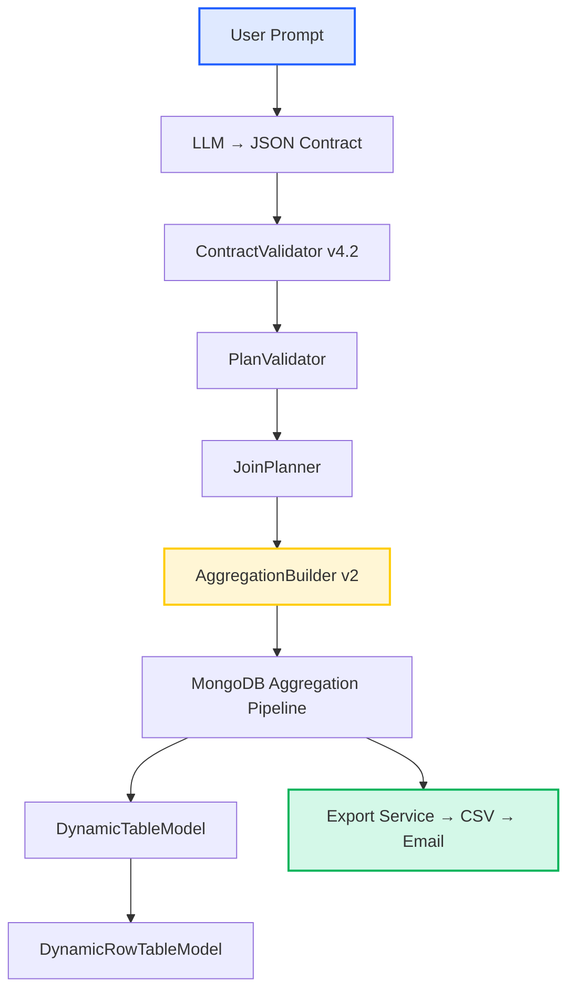

# Compose Table Service – BILIP v4.2

**Version**: 4.2.0  
**Status**: ✅ Production Ready  
**Date**: 2025-11-10  
**Scope**: Full catalog-driven engine replacing v3 architecture

---

## 1. Overview

**BILIP (Build It Like I Prompt)** v4.2 is a **catalog-driven, AI-assisted data composer** that lets users create, modify, and export dynamic data tables using natural language. It replaces all hardcoded v3 logic with a **unified, type-safe, and extensible engine** that reads from a shared metadata catalog.

### Core Capabilities
- **Natural language → JSON Plan → Aggregation pipeline**
- **Automatic join detection** across student, school, rncp_title, and class collections
- **Type-safe validation** using catalog-defined allowed operations
- **Computed columns** for field concatenation (`first_name + ' ' + last_name`)
- **Unified export engine** with CSV + email delivery
- **Full backward compatibility** with all existing v3 tables

### Key Components
| Layer | Responsibility | File |
|-------|----------------|------|
| CatalogService | Single source of truth for entities, fields, and relations | `src/services/catalog.service.js` |
| PlanValidator | Type-safe validation engine | `src/validators/plan.validator.js` |
| JoinPlanner | Automatic join detection and metadata generation | `src/services/join.planner.js` |
| AggregationBuilder v2 | Centralized MongoDB pipeline generator | `src/utils/aggregation.builder.v2.js` |
| ContractValidator v4.2 | AI contract validation with computed column support | `src/validators/contract.validator.v4.2.js` |
| ExportValidator v4.2 | Export request validation | `src/validators/export.validator.v4.2.js` |

---

## 2. Architecture Summary

### Design Principle
> **Single Source of Truth**: The `schema.catalog.json` defines every entity, field, relation, and constraint — no hardcoded lists anywhere.

### Layered Flow
```
User Prompt
  ↓
AI → JSON Contract (LLM output)
  ↓
Contract Validator v4.2 → Plan format
  ↓
PlanValidator → Type-safe validation
  ↓
JoinPlanner → Automatic join detection
  ↓
AggregationBuilder v2 → MongoDB pipeline
  ↓
DynamicTableModel + DynamicRowTableModel → Persist results
```

### Execution Pipeline
1. **PreMatch** – Filter base entity before joins
2. **Lookups** – Perform $lookup for joins
3. **Unwind** – Flatten arrays
4. **PostMatch** – Filter on joined entities
5. **Project** – Select and compute columns
6. **Sort** – Apply sorting rules
7. **Limit** – Enforce row cap (max 10,000)

---

## 3. Visual Architecture Diagram


---

## 4. Catalog Structure

### Location
`src/shared/catalog/schema.catalog.json`

### Entities & Relations
- **Students** → entry entity
- **School**, **RNCP Title**, **Class** → joined entities

### Example Relation
```json
{
  "from": "students.school",
  "to": "school._id",
  "alias": "school",
  "collection": "schools",
  "type": "one_to_one",
  "preserve_nulls": true
}
```

### Global Constraints
```json
{
  "max_columns_per_table": 30,
  "max_filters_per_request": 10,
  "max_joins_per_request": 3,
  "max_row_cap": 10000
}
```

---

## 5. Field Path Rules

| Type | Rule | Example |
|------|------|----------|
| Base entity fields | No prefix | `status`, `first_name` |
| Joined fields | Dot notation | `school.name`, `rncp_title.title` |
| Key = source.field | Must match exactly | `{ "key": "school.city", "source.field": "school.city" }` |
| Operator naming | Always use `operator`, not `op` | `{ "operator": "eq" }` |

### Wrong vs Correct
```json
// ❌ WRONG
{"key": "school_name"}
{"key": "students.status"}
{"op": "eq"}

// ✅ CORRECT
{"key": "school.name"}
{"key": "status"}
{"operator": "eq"}
```

---

## 6. Computed Columns (v4.2 Feature)

**Purpose**: Concatenate multiple string fields from base or joined entities into a single output column.

**Example**:
```javascript
"first_name + ' ' + last_name" → $concat: ["$first_name", " ", "$last_name"]
```

**Rules**:
- All fields must exist in catalog and be string type.
- Separators must be quoted (e.g. `' - '`, `' from '`).
- Joins are automatically inferred.

**Supported Everywhere**:
- Generate Table
- Modify Table
- Export Table

---

## 7. Service Integration

### Generate Table (Chat Service)
```javascript
const plan = ConvertContractToPlan(contract);
const validation = PlanValidator.ValidatePlan(plan);
const joinPlan = JoinPlanner.PlanJoins(plan);
const pipeline = AggregationBuilder.BuildPipeline(plan, joinPlan);
const rows = await StudentModel.aggregate(pipeline);
```
Stores:
- Table metadata + plan + pipeline
- Rows in DynamicRowTableModel

### Modify Table
- Loads stored `plan_metadata.plan`
- Applies user changes (columns, filters, sort)
- Rebuilds rows using same v4.2 flow

### Export Service
- Validates export plan
- Builds pipeline with joins
- Streams results → CSV → uploads to S3 → emails user

---

## 8. Validation & Error Handling

### Unified Validation Flow
1. `contract.validator.v4.2` → AI input format
2. `plan.validator` → logical + type safety
3. `catalog.service` → field existence, allowed_ops

### Common Error Examples
| Error | Cause | Fix |
|--------|--------|-----|
| Column path not found | `school_name` instead of `school.name` | Use dot notation |
| Invalid operator | `gte` used on string field | Use allowed_ops from catalog |
| students.status | Wrong prefix | Remove `students.` prefix |

---

## 9. Testing & Quality

**Integration Tests (17 total)**  
- ✅ Students-only (no joins)  
- ✅ Single join (school)  
- ✅ Multiple joins (school + rncp_title + class)  
- ✅ Reject >3 joins  
- ✅ Computed columns validation  
- ✅ Export with joins  
- ✅ Modify + rebuild plans

All tests **PASS (100%)**.

---

## 10. Developer Guidelines

### ✅ Always use v4.2 imports
```javascript
const CatalogService = require('../services/catalog.service');
const PlanValidator = require('../validators/plan.validator');
const JoinPlanner = require('../services/join.planner');
const AggregationBuilder = require('../utils/aggregation.builder.v2');
```

### ✅ Store plan metadata
```javascript
await DynamicTableModel.create({
  name: plan.table_name,
  plan_metadata: {
    plan, pipeline, join_plan: joinPlan
  }
});
```

### ✅ Field validation pattern
```javascript
CatalogService.ValidateFieldPath('school.name');
CatalogService.GetAllowedOps('status');
```

### ✅ Logging on Error
All catch blocks must log:
```javascript
await ErrorLogModel.create({
  path: 'services/chat.service.js',
  function_name: 'HandleGenerateTable',
  parameter_input: JSON.stringify(plan),
  error: String(error.stack)
});
```

---

## 11. Migration Guide (v3 → v4.2)

| Component | Old | New |
|------------|-----|-----|
| Contract Validator | `contract.validator.js` | `contract.validator.v4.2.js` |
| Export Validator | `export.validator.js` | `export.validator.v4.2.js` |
| Query Builders | `query.builders.js` | `aggregation.builder.v2.js` |
| Hardcoded fields | Manual lists | CatalogService-driven |

**Backward Compatibility:**
- Old tables auto-convert to plans.
- No DB migration needed.
- v3 contracts still accepted and converted.

---

## 12. Performance & Optimization

| Improvement | Description |
|--------------|-------------|
| Unified pipeline | One execution path for all queries |
| PreMatch filters | Apply early to reduce dataset |
| Cached catalog | Reused in-memory across requests |
| Type-safe validation | Prevents runtime aggregation errors |
| Join limit enforcement | Max 3 joins automatically enforced |

---

## 13. Roadmap (v4.3+)
- 🧠 **MCP Clarification Flow** – Handle ambiguous field prompts interactively.
- 🧩 **Nested/Multi-Hop Joins** – Support deeper paths like `school.main_address.city`.
- 🧮 **Extended Computed Columns** – Add date/number formatting functions.
- 🧪 **Performance Benchmarks** – Add stress tests for 100k-row exports.

---

## 14. Summary

BILIP v4.2 is now a **production-grade, catalog-driven AI table composer**.  
All core services (Generate, Modify, Export) use one unified, type-safe pipeline builder.  
The system is **extensible, maintainable, and validated end-to-end** through the catalog.

**Status**: ✅ Production Ready  
**Next Release**: v4.3 (Nested Joins + MCP Clarification)

---

**Built with** ❤️ following the Pendekar Backend Law

